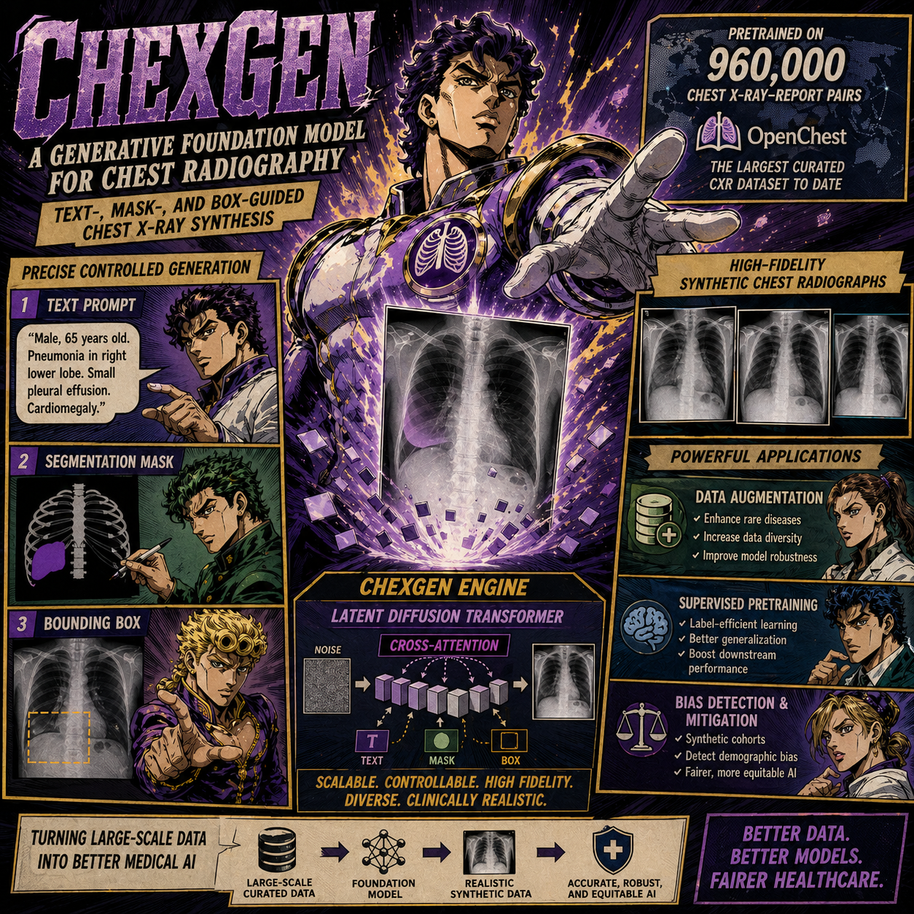

# ChexGen: A Generative Foundation Model for Chest Radiography

<p align="center">
  <a href="https://arxiv.org/abs/2509.03903"></a>
  <a href="https://ai.nejm.org"></a>
  <a href="#license"></a>
</p>

ChexGen is a generative foundation model for chest radiography. It synthesizes chest X-rays from radiology text prompts and optional control inputs, and is designed to support synthetic data generation, downstream model development, and research on robustness and fairness in medical imaging.

<table>
<tr>
<td width="45%" valign="top">

## Contents

- [News](#news)
- [Highlights](#highlights)
- [Available Checkpoints](#available-checkpoints)
- [Installation](#installation)
- [Sampling](#sampling)
- [Fine-tuning](#fine-tuning)
- [Project Structure](#project-structure)
- [Intended Use and Limitations](#intended-use-and-limitations)
- [Citation](#citation)
- [License](#license)
- [Acknowledgements](#acknowledgements)

</td>
<td width="55%" valign="top">



</td>
</tr>
</table>

## News

- **[2026.04]** Open-sourced: model code, released checkpoints (text-to-image + demographic + SIIM control), fine-tuning scripts, and the MIMIC-CXR data-augmentation downstream pipeline with original training logs (see [`downstream/classification/`](downstream/classification/)).
- **[2026.03]** ChexGen has been accepted by **NEJM AI**. [Published article](paper/AIoa2500799.pdf) and [supplementary appendix](paper/aioa2500799_appendix.pdf) are available.
- **[2025.09]** Paper released on [arXiv](https://arxiv.org/abs/2509.03903).

## Highlights

- Latent diffusion transformer (DiT) architecture for chest radiograph generation.
- Trained on 960,000 radiograph-report pairs.
- Text- and control-conditioned generation from radiology impressions.
- Checkpoints for multiple resolutions and conditioning settings.
- Open research code for model loading, text embedding, diffusion sampling, and dataset utilities.

## Available Checkpoints

The training data includes [MIMIC-CXR](https://physionet.org/content/mimic-cxr-jpg/), which requires credentialed access via [PhysioNet](https://physionet.org/). For that reason, access to model weights requires verification.

- **`pretrained_256.pth`** — 256×256 pretraining checkpoint; starting point for all fine-tunes.
- **`finetuned_impression_512.pth`** — 512×512, conditioned on impression text. Config: [`configs/sample/finetuned_impression_512.py`](configs/sample/finetuned_impression_512.py).
- **`finetuned_demographic_impression_512.pth`** — 512×512, impression text + sex/age/race demographics. Config: [`configs/sample/finetuned_demographic_impression_512.py`](configs/sample/finetuned_demographic_impression_512.py).
- **`finetuned_control_siim_512.pth`** — 512×512, control-conditioned (SIIM pneumothorax mask). Config: [`configs/sample/finetuned_control_siim_512.py`](configs/sample/finetuned_control_siim_512.py).

The quick start below demonstrates text-conditioned generation with `finetuned_impression_512.pth`. Other checkpoints should be paired with their matching config and input format.

### Request Weights

1. Obtain [PhysioNet credentialed access](https://physionet.org/settings/credentialing/) by completing the required training.
2. Fill out the [Model Access Request Form](https://docs.google.com/forms/d/e/1FAIpQLSdb9grrTKpslvaaRmShY86nPyv2478fVm9VsELPPkTTzQR6Sg/viewform).
3. After approval, place downloaded checkpoints under `weights/`.

Recommended layout:

```text
weights/
  finetuned_impression_512.pth
  finetuned_demographic_impression_512.pth
  finetuned_control_siim_512.pth
  pretrained_256.pth
```

Checkpoint files are intentionally ignored by git.

## Installation

```bash
git clone https://github.com/era-ai-biomed/ChexGen.git
cd ChexGen
pip install -r requirements.txt
pip install -e .
```

Key dependencies include PyTorch, torchvision, Transformers, Diffusers, xFormers, MMEngine, timm, and sentencepiece. Sampling requires an NVIDIA GPU with CUDA.

For fine-tuning, additionally install `accelerate` and `pynvml`:

```bash
pip install accelerate pynvml
```

### Encoders (VAE & T5)

The pipeline uses `stabilityai/sd-vae-ft-ema` (VAE) and `DeepFloyd/t5-v1_1-xxl` (T5). Both auto-download from Hugging Face on first use; nothing to do manually.

## Sampling

ChexGen ships two sampling paths: text-to-image (`tools/sample.py`) and mask-conditioned generation (`tools/sample_control.py`).

### Text-to-image

The default text-to-X-ray path uses `weights/finetuned_impression_512.pth` paired with [`configs/sample/finetuned_impression_512.py`](configs/sample/finetuned_impression_512.py). Examples below use this 512 impression setup; swap in another checkpoint + matching config for a different release.

#### Quick Start

After placing the matching checkpoint(s) under `weights/`, pick one of the wrappers:

```bash
bash scripts/sample_impression.sh                # finetuned_impression_512.pth + 5 built-in prompts
bash scripts/sample_csv.sh                       # finetuned_impression_512.pth + data/mimic_val_p19_impression_example.csv
bash scripts/sample_demographic_impression.sh    # finetuned_demographic_impression_512.pth + data/mimic_val_p19_demographic_impression_example.csv
```

`sample_csv.sh` also accepts a custom CSV path:

```bash
bash scripts/sample_csv.sh path/to/your_prompts.csv
```

Outputs land in `visualization/` along with a `prompts.txt` mapping each image to its source prompt.

#### Direct Sampler Invocation

For one-off prompts or non-default flags, call `tools/sample.py` directly:

```bash
torchrun \
    --nproc_per_node=1 \
    --master_port=12345 \
    tools/sample.py configs/sample/finetuned_impression_512.py weights/finetuned_impression_512.pth \
    --work-dir output/ \
    --text-prompt "Moderate cardiomegaly with mild vascular congestion." \
    --cfg-scale 4.0 \
    --num-sampling-steps 100 \
    --seed 1234
```

#### Prompt Files

Pass `--text-prompt-file` instead of `--text-prompt` to batch over a file:

```bash
torchrun \
    --nproc_per_node=1 \
    --master_port=12345 \
    tools/sample.py configs/sample/finetuned_impression_512.py weights/finetuned_impression_512.pth \
    --work-dir output/ \
    --text-prompt-file prompts.csv
```

Supported formats:

- `.csv`: use `--text-prompt-key` for the prompt column. A `name` column is optional and controls output file names.
- `.json`: list of strings or list of objects containing the prompt key.
- `.jsonl`: one string or object per line.
- `.txt`: one prompt per line.

A ready-to-run example ships at [`data/mimic_val_p19_impression_example.csv`](data/mimic_val_p19_impression_example.csv) (10 rows; columns `name`, `Finding Labels`, `impression`):

```csv
name,Finding Labels,impression
chest_001.png,No Finding,No acute cardiopulmonary abnormality. ...
chest_002.png,Cardiomegaly,Mild enlargement of the cardiac silhouette without overt pulmonary edema.
chest_003.png,Pleural Effusion,New small loculated pleural effusion within the major fissure of the right lung.
```

The default `--text-prompt-key` is `impression`; override only if your CSV uses a different column name. If the `name` column is omitted, outputs are saved as `0.png`, `1.png`, ... by row index.

#### Multi-GPU Sampling

The sampler uses `DistributedSampler` to shard prompts across ranks, so larger prompt files can be parallelised across GPUs. Set `--nproc_per_node` to the number of available GPUs (and update `NUM_GPUS` in the wrapper you're using):

```bash
torchrun \
    --nproc_per_node=4 \
    --master_port=12345 \
    tools/sample.py configs/sample/finetuned_impression_512.py weights/finetuned_impression_512.pth \
    --work-dir output/ \
    --text-prompt-file prompts.csv
```

#### Common Parameters

- `--cfg-scale` (default `4.0`) — Classifier-free guidance scale.
- `--num-sampling-steps` (default `100`) — Number of diffusion denoising steps.
- `--seed` (default `0`) — Random seed.
- `--batch-size` (default `1`) — Batch size per GPU. Use `1` for best fidelity; larger values run faster but route cross-attention through `xformers` `BlockDiagonalMask`, with small numerical drift across the 100 sampling steps.
- `--text-prompt-file` (default `None`) — Prompt file path.
- `--text-prompt-key` (default `impression`) — Prompt field for CSV/JSON/JSONL files.

#### Demographic-conditioned

`finetuned_demographic_impression_512.pth` accepts impressions prefixed with sex/age/race attributes. The bundled CSV [`data/mimic_val_p19_demographic_impression_example.csv`](data/mimic_val_p19_demographic_impression_example.csv) shows the expected `impression` format:

```csv
name,Finding Labels,impression
chest_sar_001.png,No Finding,"sex:Male, age:71.0, race:Black. No acute findings in the chest."
chest_sar_002.png,Cardiomegaly,"sex:Male, age:61.0, race:White. Mild cardiomegaly. No signs of pneumonia or edema."
```

Run via the wrapper:

```bash
bash scripts/sample_demographic_impression.sh
```

### Mask-conditioned

`finetuned_control_siim_512.pth` adds spatial conditioning on a pneumothorax segmentation mask via the `ControlT2IDiT` wrapper. It uses a different entry point — `tools/sample_control.py` — and a CSV with three columns: `name`, `impression`, `mask`.

A ready-to-run example ships with the repo:

- prompts: [`data/siim_control_example.csv`](data/siim_control_example.csv) (10 SIIM pneumothorax cases)
- masks: `data/siim_masks/*.png` (binary masks keyed by SIIM dicom UID)

```bash
bash scripts/sample_control_siim.sh                        # default CSV + masks under data/siim_masks
bash scripts/sample_control_siim.sh path/to/prompts.csv    # custom CSV
COND_DIR=/abs/path/to/masks bash scripts/sample_control_siim.sh prompts.csv
```

The mask column may hold either a path relative to `COND_DIR` (default `data/siim_masks/`) or an absolute path. Override the column names with `TEXT_KEY` / `COND_KEY` env vars if your CSV uses different headers. Each generated `<name>.png` is paired with a `<name>_mask.png` sidecar (the resized 512×512 input mask) so input/output correspondence is preserved.

## Fine-tuning

> **Note:** the fine-tuning code below has been cleaned up for release but not re-run end-to-end after the reorganization. If anything breaks, please open an issue or reach out to the authors.

All fine-tuning runs start from the **256×256 pretraining checkpoint** `weights/pretrained_256.pth`. When the resolution changes (e.g. 256 → 512 / 1024) `pos_embed` and `y_embedder.y_embedding` are re-initialized; every other DiT weight is loaded in. Make sure `pretrained_256.pth` is placed under `weights/` before launching a fine-tune.

A reference text-to-image config ships at [`configs/train/mimic-example.py`](configs/train/mimic-example.py); it sets `pretrained = 'weights/pretrained_256.pth'`. Copy and edit it for your dataset.

### Data Preparation

Fine-tuning reads **pre-extracted** features (VAE image latents + T5 caption embeddings), not raw pixels and text. Run the offline pipeline once per dataset before launching `tools/train.py` or `tools/train_control.py`.

#### 1. VAE-encode images

```bash
python tools/preprocess/image_preprocess.py \
    --data_path        /abs/path/to/raw/images          # directory of .png/.jpg files
    --image_size       512                              # match your model's resolution
    --batch_size       20 \
    --embedding_save_dir /abs/path/to/image_embedding_512 \
    --parts 1 --index 0                                 # split for multi-GPU sharding
```

Each input image becomes `<embedding_save_dir>/<name>.npz` with key `image` (4×H/8×W/8 latent).

#### 2. T5-encode captions

```bash
python tools/preprocess/caption_preprocess.py \
    --csv_dir          /abs/path/to/captions.csv        # must have a 'name' column
    --key              impression                       # CSV column for the prompt text
    --token-nums       120                              # match model.token_num in the train config
    --embedding_save_dir /abs/path/to/caption_embedding
```

Outputs `<name>.npz` with keys `caption_embedding` (token_num × 4096) and `caption_mask` (token_num bool).

#### 3. (Control models only) VAE-encode masks

Re-run `image_preprocess.py` against the mask directory:

```bash
python tools/preprocess/image_preprocess.py \
    --data_path        /abs/path/to/masks \
    --image_size       512 \
    --embedding_save_dir /abs/path/to/cond_embedding_512 \
    --parts 1 --index 0
```

#### 4. Build the data list

`T2IDataset` consumes a flat `.txt` where each line is space-separated paths to the embedding files:

```bash
python tools/preprocess/generate_data_list_file.py \
    --dir-list       /abs/path/to/data/mimic-cxr \
    --target-folders image_embedding_512 caption_embedding \
    --save-file      /abs/path/to/data/meta/second_stage_impression_512.txt
```

For control models, append `cond_embedding_512` to `--target-folders`. Point `dataloader.dataset.data_list_file` at the resulting `.txt` in your fine-tuning config.

### Text-to-image (`tools/train.py`)

```bash
# single GPU
bash scripts/train.sh configs/train/mimic-example.py

# multi-GPU
NUM_GPUS=4 bash scripts/train.sh configs/train/mimic-example.py
```

### Control / mask-conditioned (`tools/train_control.py`)

`ControlT2IDiT` wraps a frozen base DiT with a trainable copy of the first 13 blocks. For control fine-tunes, the recommended starting point is still `weights/pretrained_256.pth` (matches how the released `finetuned_control_siim_512.pth` was trained). Set `pretrained` in the config or pass `--pretrained` on the CLI:

```bash
NUM_GPUS=4 bash scripts/train_control.sh configs/train/your_control_config.py \
    --pretrained weights/pretrained_256.pth
```

The dataset must include cond paths — set `dataloader.dataset.use_cond=True` in the config and make sure the data list (step 4 above) has 3 columns per line (image, text, cond).

### Resume

Both wrappers honor `--resume`:

```bash
NUM_GPUS=4 bash scripts/train.sh configs/train/mimic-example.py \
    --resume work_dirs/mimic-example/epoch_100_step_100000.pth
```

`auto-resume` is on by default — re-running the same command picks up the latest `.pth` in `work_dir` and ignores `pretrained`.

## Project Structure

```text
ChexGen/
  configs/
    sample/           Inference configs (one per released checkpoint)
    train/            Fine-tuning configs (mimic-example.py, ...)
  data/               Example prompt CSVs and SIIM masks
  radiffuser/
    models/           DiT, T5 text encoder, embedders, control modules
    diffusion/        Gaussian diffusion and timestep respacing
    datasets/         Text and text-to-image dataset loaders
    utils/            Checkpoint loading, logging, synchronization
  scripts/            Shell wrappers (sample_*.sh, train.sh, train_control.sh)
  tools/
    sample.py         Text-to-image inference
    sample_control.py Mask-conditioned inference
    train.py          Text-to-image fine-tuning
    train_control.py  Mask-conditioned fine-tuning
    preprocess/       Offline feature extractors (image / caption / data list)
```

## Intended Use and Limitations

ChexGen is released for research use. Generated images are synthetic and should not be used as a substitute for clinical imaging, diagnosis, treatment planning, or medical decision-making. Users are responsible for validating synthetic data in their own downstream settings, including checks for artifacts, label leakage, demographic bias, and task-specific failure modes.

## Citation

If you find this work useful, please cite:

```bibtex
@article{ji2026generative,
  title={A generative foundation model for chest radiography},
  author={Ji, Yuanfeng and Lin, Dan and Wang, Xiyue and Zhang, Lu and Zhou, Wenhui and Ge, Chongjian and Chu, Ruihang and Yang, Xiaoli and Zhao, Junhan and Chen, Junsong and others},
  journal={NEJM AI},
  pages={AIoa2500799},
  year={2026},
  publisher={Massachusetts Medical Society}
}
```

## License

This project is released under the [Apache 2.0 License](LICENSE).

## Acknowledgements

This codebase builds upon [DiT](https://github.com/facebookresearch/DiT) and [PixArt-alpha](https://github.com/PixArt-alpha/PixArt-alpha). We thank the authors for their excellent work.
